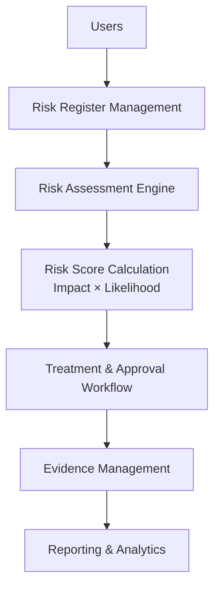
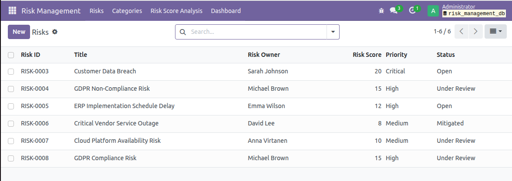
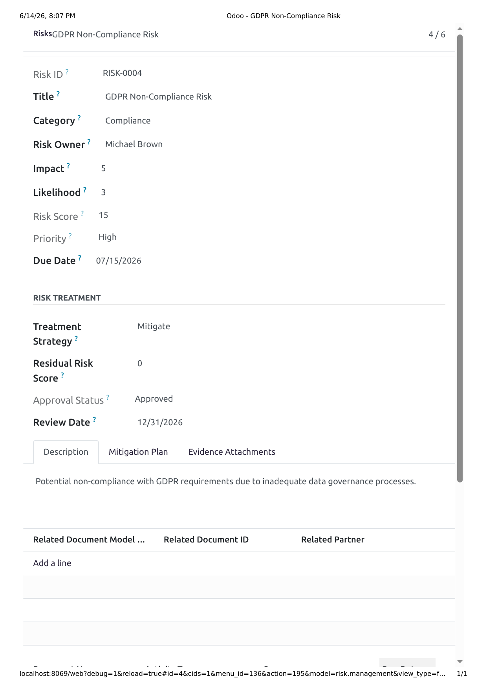
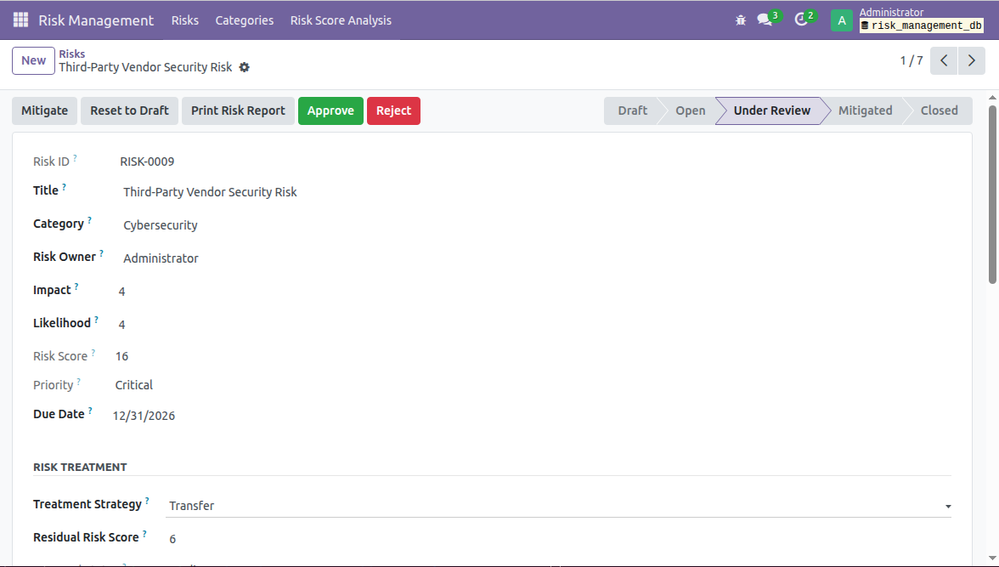
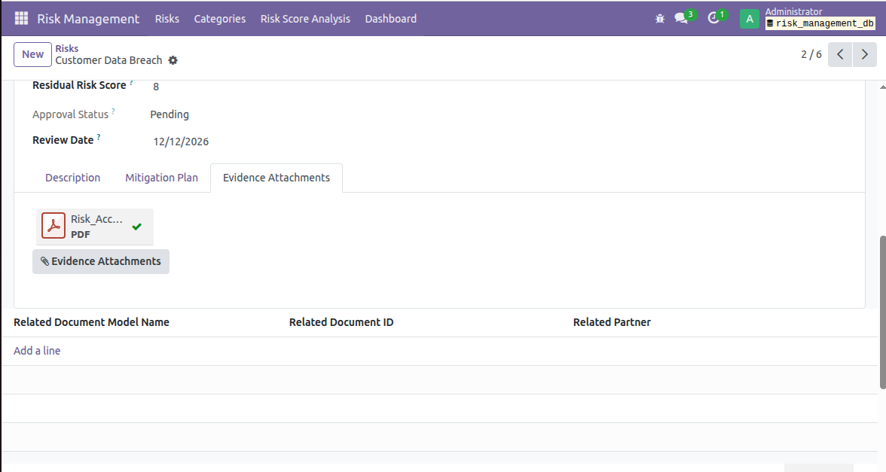
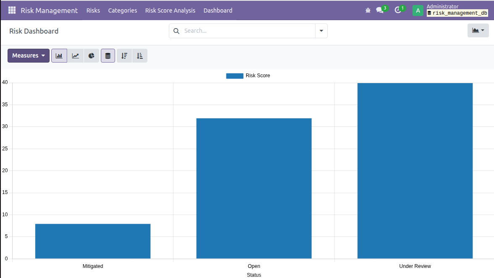
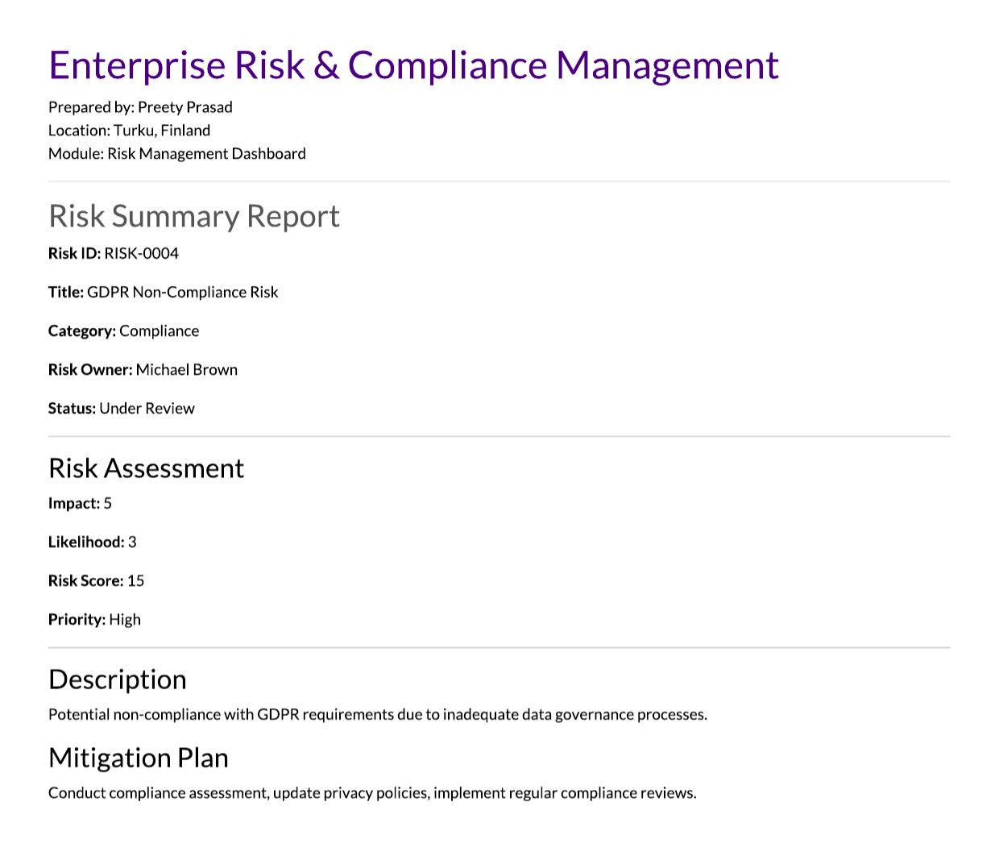

# Enterprise Risk & Compliance Management for Odoo 17

## Overview

Enterprise Risk & Compliance Management is a custom-built Odoo 17 module developed to support enterprise governance, risk management, and compliance (GRC) processes.

The solution enables organizations to systematically identify, assess, prioritize, treat, monitor, and report risks through a centralized platform. It provides structured workflows, approval mechanisms, evidence management, reporting capabilities, and analytical dashboards to support risk-informed decision-making.

This project was developed as a portfolio demonstration of enterprise risk management concepts, workflow automation, compliance governance, and Odoo application development.

## Business Problem

Organizations often manage risks using spreadsheets, emails, and disconnected documentation, resulting in:

- Limited visibility into enterprise risks
- Inconsistent risk assessment practices
- Lack of accountability and ownership
- Missing audit trails
- Difficulty tracking mitigation activities
- Challenges during compliance audits

This module addresses these challenges by providing a centralized and auditable risk management platform.

## Key Features

### Risk Register Management
Unique risk identification
Risk categorization
Risk ownership assignment
Risk description and mitigation planning
Due date tracking

### Risk Assessment Engine

The module automatically evaluates risk severity using:

Risk Score = Impact × Likelihood

Features include:

Impact assessment
Likelihood assessment
Automated risk score calculation
Automatic priority classification

### Risk Lifecycle Workflow

The solution supports a structured risk management lifecycle:

Draft → Open → Under Review → Mitigated → Closed

This workflow ensures consistent risk handling and governance oversight.

### Risk Treatment Management

Supported treatment strategies:

Accept
Mitigate
Transfer
Avoid

Additional capabilities:

Residual risk assessment
Review scheduling
Treatment documentation

### Approval Workflow

A formal review and approval mechanism allows stakeholders to:

Approve treatment decisions
Reject treatment decisions
Track approval status
Maintain review records

### Activity & Review Tracking

The module automatically generates review activities and reminders to support ongoing risk monitoring and governance.

### Evidence & Attachment Management

Supporting documentation can be attached directly to risks, including:

- Security Review Reports
- Risk Acceptance Forms
- Compliance Assessments
- Audit Evidence
- Policy Documents

This creates an auditable record of risk-related decisions.

### Reporting & Analytics

Built-in reporting capabilities include:

PDF Risk Reports
Risk Register Views
Risk Score Analysis
Dashboard Visualizations
Pivot Analysis

## Solution Architecture

## Screenshots

### Risk Register

### Risk Treatment & Approval Workflow

### Risk Approve/Reject Workflow

### Evidence Management

### Risk Score Analysis Dashboard

### PDF Risk Reporting

## Technologies Used

| Technology | Purpose |
|------------|----------|
| Odoo 17 | ERP Platform |
| Python | Business Logic |
| XML | User Interface Views |
| PostgreSQL | Data Storage |
| QWeb Reports | PDF Reporting |
| Git | Version Control |
| GitHub | Source Code Repository |

## Future Enhancements

Planned enhancements include:

- Automated Review Reminders
- Email Notifications
- ISO 27001 Control Mapping
- GDPR Compliance Tracking
- Compliance Control Library
- Executive Risk Dashboard
- Audit Management Integration
- Risk Heatmap Enhancements

## Skills Demonstrated

This project demonstrates experience in:

- Governance, Risk & Compliance (GRC)
- Enterprise Risk Management (ERM)
- Workflow Automation
- Compliance Monitoring
- Cybersecurity Governance
- Odoo Development
- Python Development
- Reporting & Analytics
- Solution Design

## Author

## Preety Prasad

PhD Researcher in Cybersecurity
University of Turku, Finland

Research Areas:

- Cybersecurity Governance
- Enterprise Risk Management
- Explainable Artificial Intelligence (XAI)
- AI-enabled Security Architectures
- Software-Defined Networking Security
